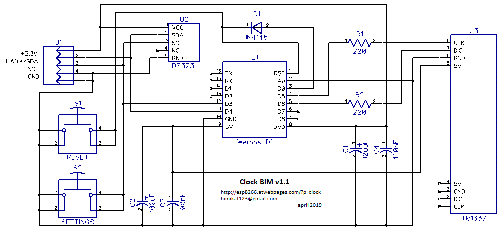

# Very simple WiFi clock based on ESP8266 and TM1637
## Clock BIM

  

* Minimum details. 3 modules and 7 SMD components.
* The clock keep good time with Internet access. Thanks to synchronization with NTP server.
* Automatic daylight saving time only if needed.
* Decreased display brightness in night mode.
* Ability to set the time and brightness of night and day mode.
* Display the temperature and humidity in the house.
* The possibility of correction of temperature and humidity.
* Automatic connection to one of the 10 WiFi saved networks.
* Remote access to the settings of the clock.
* Simple and understandable even to an unprepared person settings.
* Ability to update the firmware over the air.
* The settings interface is available in 9 languages: English, Russian, Romanian, German, Estonian, Ukrainian, Azerbaijani, Belarusian and Bulgarian.

## Schematics diagram

  

**U1** is the heart of the clock this is **Wemos D1 mini** module, it is a module on an **ESP8266** chip with all the necessary environment besides a **USB -> UART** converter and a **3.3V** converter are built into this module.

  

The **U3** display is a 0.5-inch 7-segment LED display module with an integrated **TM1637** display control chip. Of course you can use the display and a smaller or bigger size but the board is made for this size.

  

The **U2** clock module on the **DS3231** chip is needed to support the clock in the event of the loss of the Internet. This module can not be installed if you have a stable Internet. Firmware version 1.1 will determine for itself whether the clock module is installed or not.

  

Resistors **R1** and **R2** as well as the diode **D1** are used to protect the pins of **ESP8266** from overload you can replace the jumpers but it is unsafe. Filtering capacitors **C1**-**C4** can be not installed but then possibly unstable clock's work, freezes, malfunctions. The buttons **S1** and **S2** are needed accordingly for resetting and entering the clock into the settings mode. Buttons as you may have guessed can also not be installed. **J1** connector is used to connect the temperature and humidity sensors. Sensors should be located at a distance of at least 10 cm from the clock since the clock in operation is slightly warm and the sensors are very sensitive. If you don’t need temperature and/or humidity indication then you can not install the sensors respectively **J1** connector will not be needed either.

The clock supports the following sensors: **DS18B20**, **BME280** and **SHT21 (HTU21D)**. You can connect one or all the sensors together. In the settings you can choose which sensor what to measure. The sensors are connected to connector **J1**, the pin assignment is shown in the schematics diagram.

You can power the clock by any charger from the mobile phone with a voltage of **5V** rated for a current of at least **0.5A** with a **micro USB** connector.
