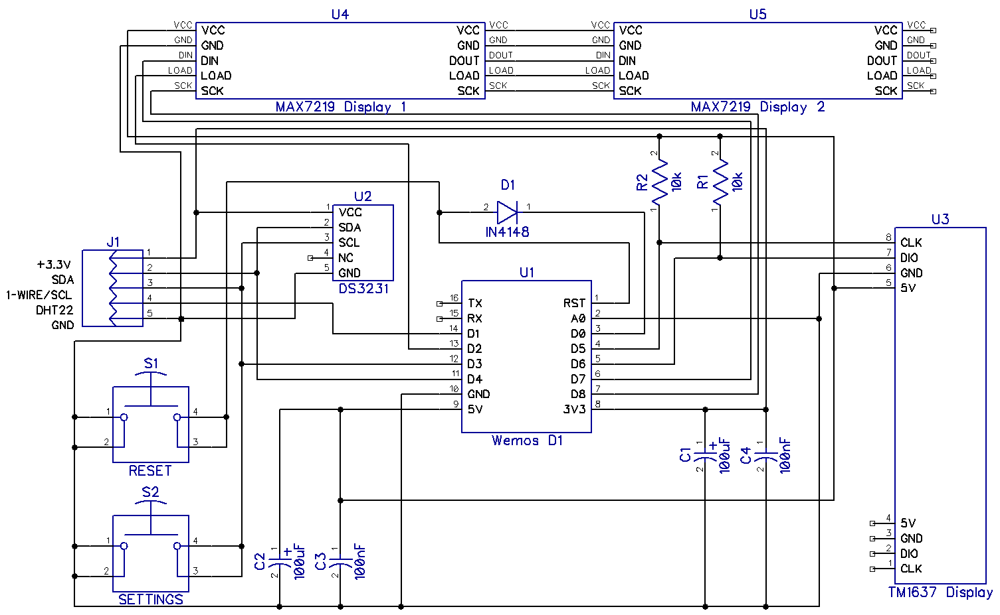
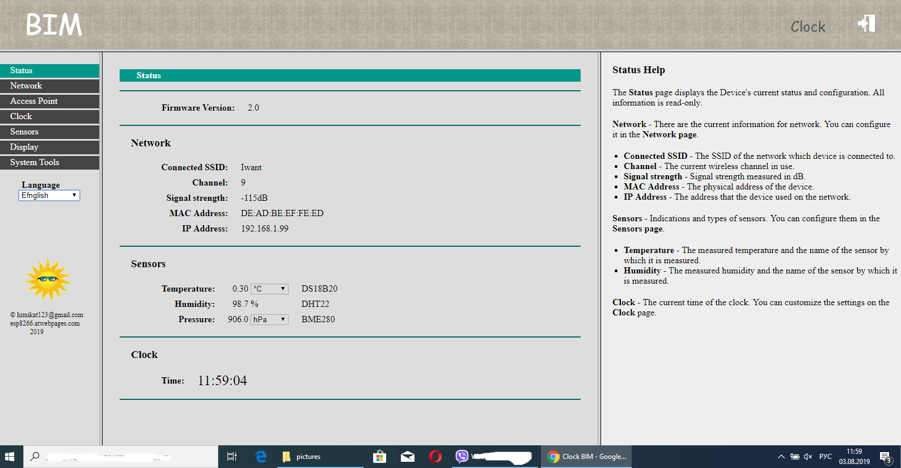

# Very simple WiFi clock based on ESP8266 and (TM1637 or MAX7219)
## Clock BIM

  

* Minimum details. 3 modules and 7 SMD components.
* The clock keep good time with Internet access. Thanks to synchronization with NTP server.
* Automatic daylight saving time only if needed.
* Decreased display brightness in night mode.
* Ability to set the time and brightness of night and day mode.
* Display the temperature and humidity in the house.
* The possibility of correction of temperature and humidity.
* Automatic connection to one of the 10 WiFi saved networks.
* Remote access to the settings of the clock.
* Simple and understandable even to an unprepared person settings.
* Ability to update the firmware over the air.
* The settings interface is available in 9 languages: English, Russian, Romanian, German, Estonian, Ukrainian, Azerbaijani, Belarusian and Bulgarian.

## Schematics diagram

  

<b>U1</b> is the heart of the clock this is <b>Wemos D1 mini</b> module, it is a module on an <b>ESP8266</b> chip with all the necessary environment besides a <b>USB -> UART</b> converter and a <b>3.3V</b> converter are built into this module.

  

The <b>U3</b> display is a 0.5-inch 7-segment LED display module with an integrated <b>TM1637</b> display control chip. Of course you can use the display and a smaller or bigger size but the board is made for this size.

  

The <b>U2</b> clock module on the <b>DS3231</b> chip is needed to support the clock in the event of the loss of the Internet. This module can not be installed if you have a stable Internet. Firmware version 1.1 will determine for itself whether the clock module is installed or not.

  

Resistors <b>R1</b> and <b>R2</b> as well as the diode <b>D1</b> are used to protect the pins of <b>ESP8266</b> from overload you can replace the jumpers but it is unsafe. Filtering capacitors <b>C1</b>-<b>C4</b> can be not installed but then possibly unstable clock's work, freezes, malfunctions. The buttons <b>S1</b> and <b>S2</b> are needed accordingly for resetting and entering the clock into the settings mode. Buttons as you may have guessed can also not be installed. <b>J1</b> connector is used to connect the temperature and humidity sensors. Sensors should be located at a distance of at least 10 cm from the clock since the clock in operation is slightly warm and the sensors are very sensitive. If you don’t need temperature and/or humidity indication then you can not install the sensors respectively <b>J1</b> connector will not be needed either.

The clock supports the following sensors: <b>DS18B20</b>, <b>BME280</b> and <b>SHT21 (HTU21D)</b>. You can connect one or all the sensors together. In the settings you can choose which sensor what to measure. The sensors are connected to connector <b>J1</b>, the pin assignment is shown in the schematics diagram.

You can power the clock by any charger from the mobile phone with a voltage of <b>5V</b> rated for a current of at least <b>0.5A</b> with a <b>micro USB</b> connector.

  

<a href="https://www.youtube.com/watch?v=i8bDxqybWVA&feature=youtu.be" target="_blank">
  

    
  

</a>

After assembly and flashing the clock needs to be set up. When you first turn on the clock themselves enter the settings mode. In the future to enter the settings press and hold the <b>SETTINGS</b> button until the display shows <b>"SEtt"</b>. Connect your laptop or smartphone to the network <b>Clock</b> password is <b>1234567890</b> and in the browser go to <b>http://192.168.4.1</b> address.
The default username is <b>admin</b> the password is <b>1111</b>.

  

  

