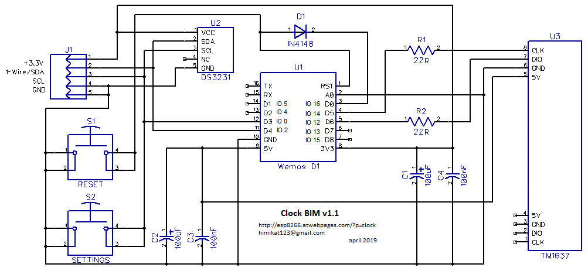

# Very simple WiFi clock based on ESP8266 and TM1637
## Clock BIM

  

* Minimum details. 3 modules and 7 SMD components.
* The clock keep good time with Internet access. Thanks to synchronization with NTP server.
* Automatic daylight saving time only if needed.
* Decreased display brightness in night mode.
* Ability to set the time and brightness of night and day mode.
* Display the temperature and humidity in the house.
* The possibility of correction of temperature and humidity.
* Automatic connection to one of the 10 WiFi saved networks.
* Remote access to the settings of the clock.
* Simple and understandable even to an unprepared person settings.
* Ability to update the firmware over the air.
* The settings interface is available in 9 languages: English, Russian, Romanian, German, Estonian, Ukrainian, Azerbaijani, Belarusian and Bulgarian.

  

